# UniPal App - Made With Flutter #
A university app to solve problems of socializing, scheduling, course selection and acheivement sharing etc.
<!-- 
## Demo
<div align="center">
  <video src="https://user-images.githubusercontent.com/62943972/149531248-ccbd3b54-1ae8-4565-807b-2f8bf2e64d21.mp4"/>
</div> -->

## Backend
For the backend it uses a REST API made using NodeJS and MySQL. Here is the link to it's code [UniPal_Backend]

### Important
Due to privacy and resource abuse concerns I have kept the url of the backend API private and you won't be able to see it. Therefore, if you want to work with this project and make your own edits, than you also need to deploy the backend on your own and pass the **URL** to the flutter app. 
Don't be confused, you **CAN** use my backend code provided above, you just have to deploy it on a server of your own. There are plenty of free options including:
 - Heroku
 - AWS Free Tier
 - Azure etc.

For more instruction visit the backend [README](https://github.com/cyntaria/UniPal-Backend#dvd-installation).

Once deployed, pass the url while running the flutter app like this:

```dart
// Replace your-url-here with your own deployed URL like "https://example.com/api/v1"
flutter run --dart-define=BASE_URL="your-url-here"
```

## :sparkles: App Features

- Authentication.
- Student Finder w/ Filters.
- Connections and Hangouts Requests.
- Timetable Generator.
- Timetable Overlap Checker.
- Teacher Reviews Forum.
- Memories and Acheivements Feed.

## :wrench: Technical Features

<table>
    <tr>
        <td><a href="https://pub.dev/packages/riverpod">Riverpod</a> State Management - v1.0.3</td>
        <td><a href="https://pub.dev/packages/dio">Dio</a> + Interceptors For JWT Refresh</td>
    </tr>
    <tr>
        <td><a href="https://pub.dev/packages/freezed">Freezed</a> + <a href="https://pub.dev/packages/flutter_hooks">Flutter Hooks</a> For JSON Handling</td>
        <td>Custom Wrapper For <a href="https://pub.dev/packages/shared_preferences">Shared Prefs</a> + <a href="https://pub.dev/packages/flutter_secure_storage">Flutter Secure Storage</a></td>
    </tr>
    <tr>
        <td>Clean Architecture</td>
        <td>Session persistence and encrypted key storage</td>
    </tr>
    <tr>
        <td>Reusable services architecture and code</td>
        <td>Custom reusable widgets</td>
    </tr>
    <tr>
        <td>Full documentation</td>
        <td>Linting + Custom Analyzer Rules</td>
    </tr>
</table>

## :iphone: Screens

Splash Screen | Home Screen | Login Screen |
:------------:|:-----------:|:--------------:|
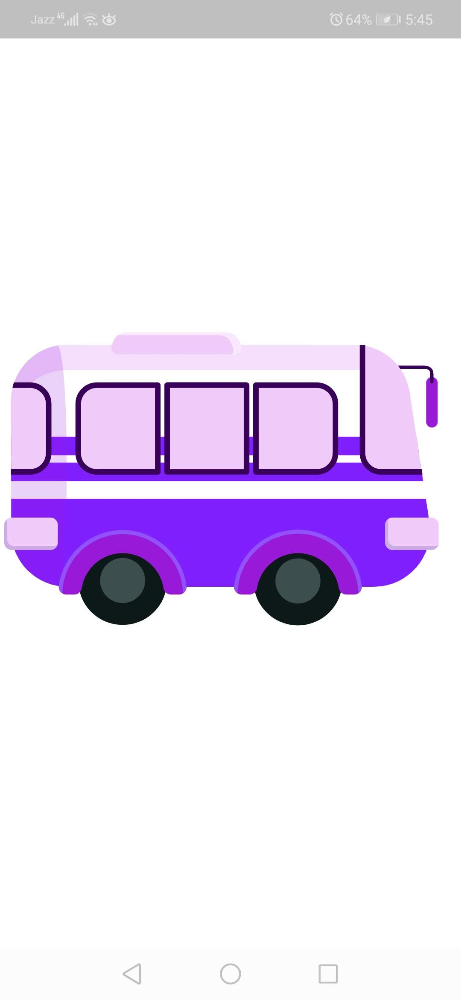 |  | 
Register Screen | Posts Screen | Create Post Screen |
 |  | 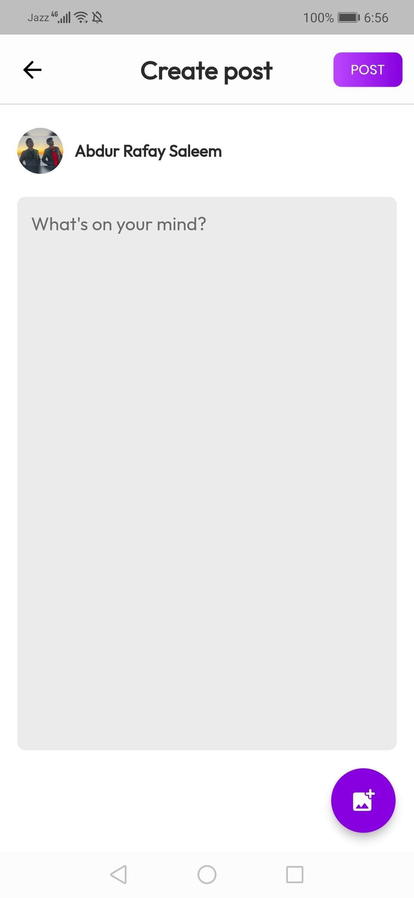
Connections Screen | Hangouts Received Screen | Hangouts Sent Screen |
 | 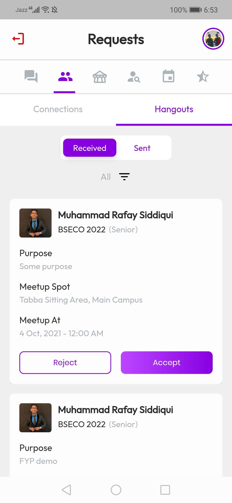 | 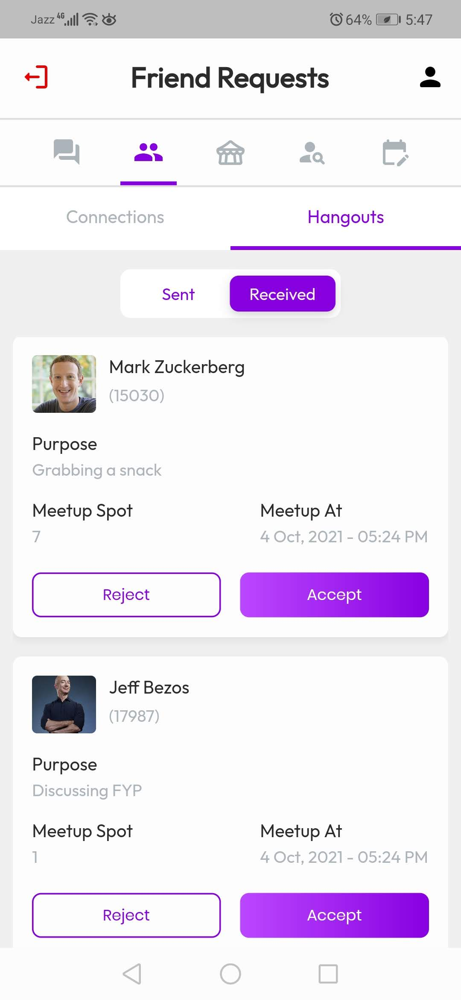
Student Finder Screen | Scheduler Screen | Student Finder Tab 2 |
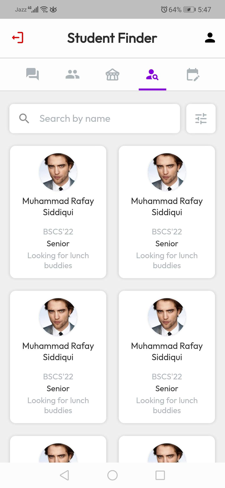 | 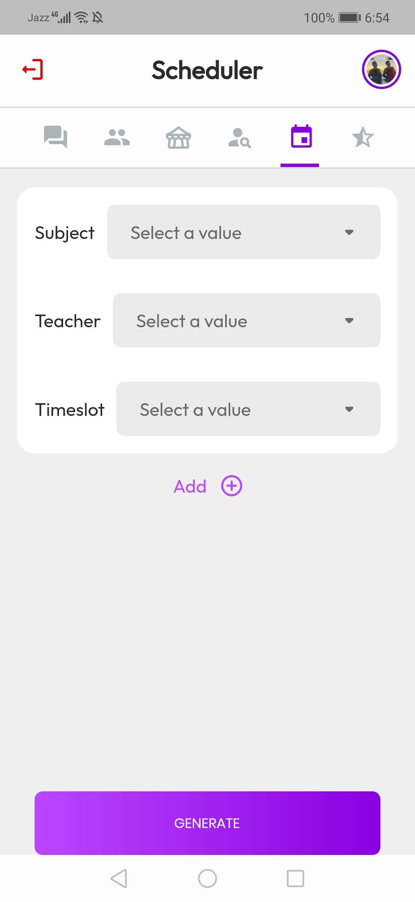 | 
Generated Timetables | Timetable Viewer | Timetable Viewer 2 |
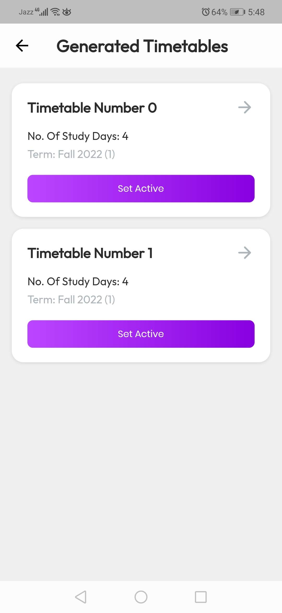 | 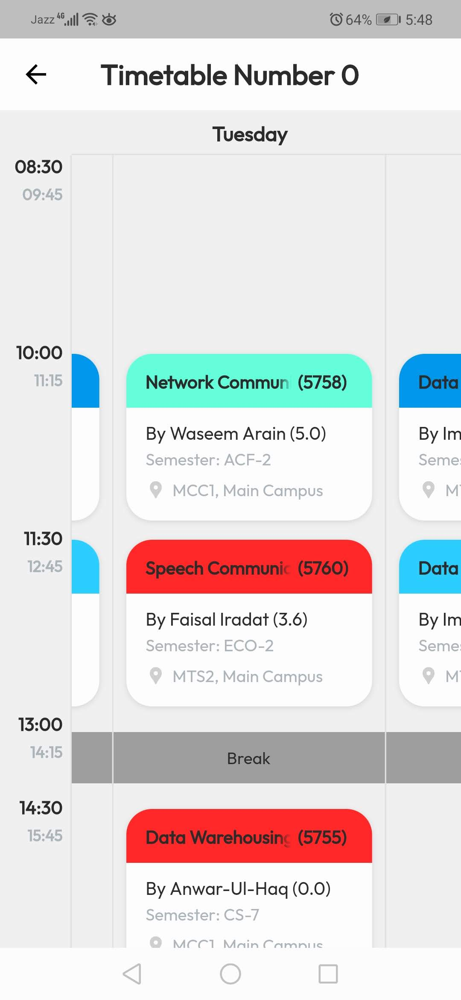 | 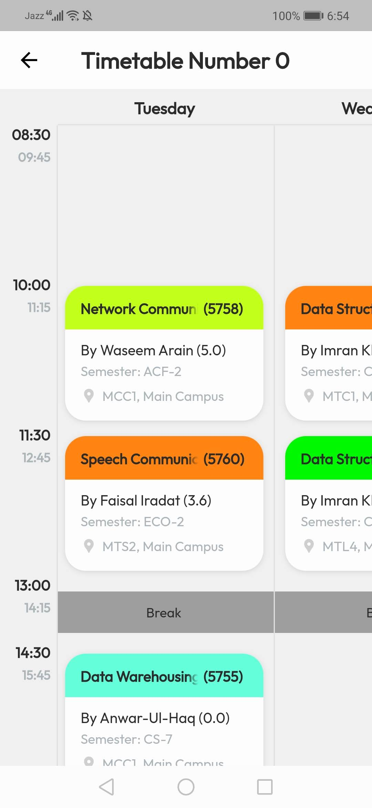
Teacher Forum Tab | Teacher Reviews Screen | My Profile About Screen |
 | 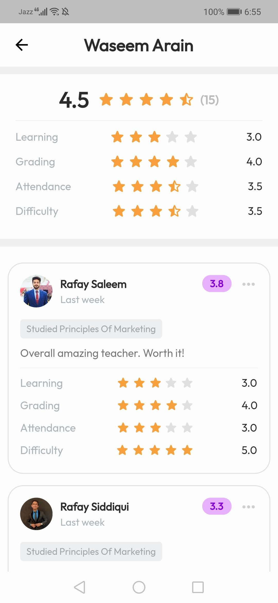 | 
My Profile Preferences | Student Profile Preferences | Student Profile About |
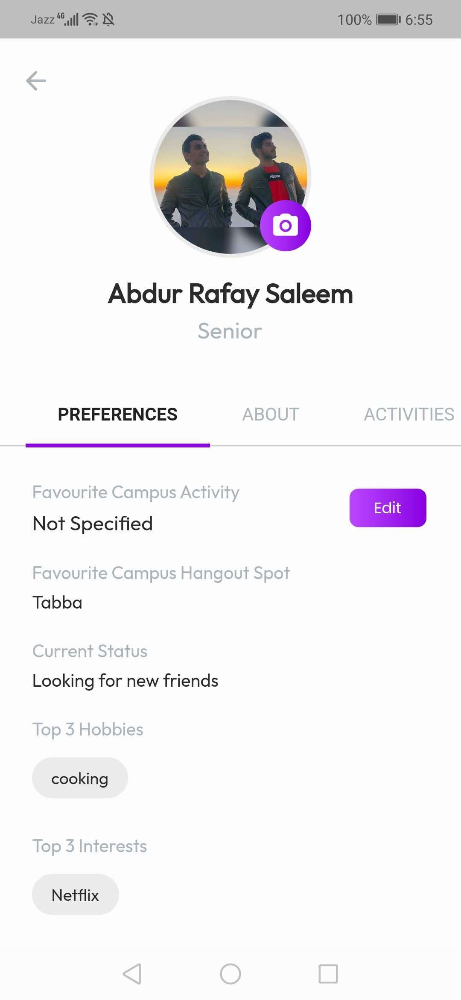 |  | 

## ⭐ Installing

This project is a starting point for a Flutter application. These series of steps need to be followed for the app to run:

    1. Make sure you are on Flutter v3.0.0 and Dart SDK 2.18
    2. If not, run `flutter uprade`.
    3. Open project dir and run this command in root directory
        ```
        flutter pub get
        ```
    4. Since the project uses code generation, alot of the files are missing initially. To generate them run this in root dir
        ```
        flutter pub run build_runner build --delete-conflicting-outputs --enable-experiment=super-parameters

## 🚀 Technologies

- [Flutter v3.0.0]
- Dart v2.17 or higher

## 🤝 Contribute

To contribute, fork the repository and push the changes to the **master** branch. Then submit a pull request for merging with the source. If your code passes the review and checks it will be merged into the master branch.

## 💬 Feedback

Feel free to send us feedback on [Twitter] or [file an issue]. Feature requests are always welcome.

## 📝 License

Licensed under the [MIT License].

[//]: # (These are reference links used in the body of this note and get stripped out when the markdown processor does its job. There is no need to format nicely because it shouldn't be seen. Thanks SO - http://stackoverflow.com/questions/4823468/store-comments-in-markdown-syntax)

[UniPal_Backend]: <https://github.com/cyntaria/UniPal-Frontend>
[Flutter v3.0.0]: <https://storage.googleapis.com/flutter_infra_release/releases/stable/windows/flutter_windows_3.0.0-stable.zip>
[Twitter]: <https://twitter.com/AbdurRafaySale2>
[file an issue]: <https://github.com/cyntaria/UniPal_Frontend/issues/new>
[MIT License]: <./LICENSE>
